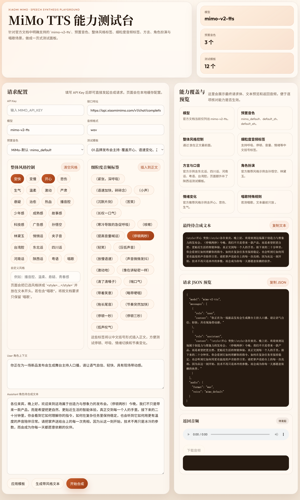

# MiMo TTS 示例页面

这是一个纯静态的 Xiaomi MiMo `mimo-v2-tts` 测试页，直接打开 [index.html](D:\Code\sonic\xiaomitts\index.html) 即可使用。

## 已覆盖的能力

- 官方文档当前列出的模型：`mimo-v2-tts`
- 预置音色：`mimo_default`、`default_zh`、`default_eh`
- 整体风格控制：``
- 细粒度音频标签：如 `（紧张，深呼吸）`、`（停顿两秒）`
- 方言/口音：东北话、四川话、河南话、粤语、台湾腔
- 角色扮演：孙悟空、林黛玉
- 情绪变化：开心、悲伤、生气
- 唱歌模式的特殊写法
- 陕西话日常表达与陕西美食介绍模板

## 使用方式

1. 打开 [index.html](D:\Code\sonic\xiaomitts\index.html)
2. 填写小米开放平台的 API Key
3. 选择模板或自行编辑文本
4. 点击“开始合成”

## 说明

- 页面会把 API Key、接口地址、音频格式、音色缓存到浏览器 `localStorage`
- `assistant` 文本才是最终用于合成的内容，符合官方文档要求
- 若风格包含 `唱歌`，页面会自动改成仅输出 `` 作为整体风格标签

# 参考

[Xiaomi MiMo 开放平台](https://platform.xiaomimimo.com/#/docs/usage-guide/speech-synthesis)
